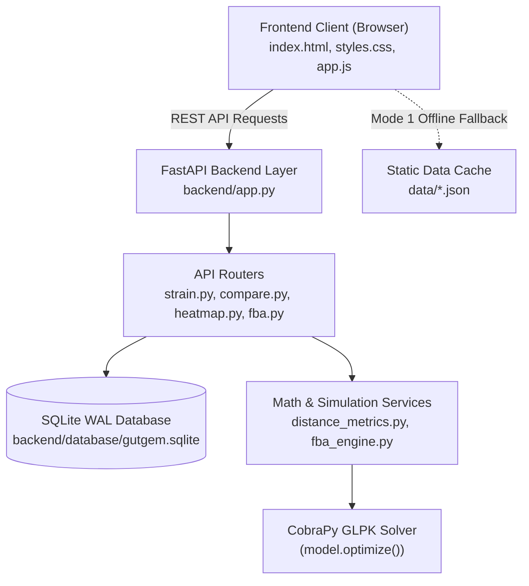

# 🧬 GutGEM Explorer v1.0

> **A Dual-Mode Computational Platform & Zero-Programming Knowledgebase for Human Gut Genome-Scale Metabolic Models (3,464 GEMs)**

[](https://fastapi.tiangolo.com/)
[](https://python.org)
[](https://cobrapy.readthedocs.io/)
[](https://sqlite.org)
[](LICENSE)

---

## 🌟 Overview

**GutGEM Explorer v1.0** is an open-source, interactive computational biology platform designed to explore, simulate, and compare strain-level metabolic exchange fluxes across **3,464 Human Gut Genome-Scale Metabolic Models (GEMs)** derived from AGORA2 Flux Balance Analysis (FBA) simulations.

The platform bridges the gap between raw computational FBA outputs and intuitive, zero-programming bio-it exploration, featuring a **Dual-Mode Architecture**, an **11-Metric Distance & Group Comparison Engine**, a **High-Contrast Canvas Heatmap Renderer**, and a **Sub-Second Live SBML XML FBA Simulation Engine**.

---

## 🚀 Key Features

### 1. 🧮 Sub-Second Real-Time SBML XML FBA Engine
- **CobraPy Integration**: Upload any custom SBML XML metabolic model (`.xml`, `.sbml`).
- **GLPK Presolve Acceleration**: Optimizes biomass growth rate ($\text{h}^{-1}$) and extracts nutrient exchange fluxes in **< 300ms**.
- **MD5 Hash Caching**: Repeated model runs execute instantly in **< 1ms**.
- **One-Click Export**: Download generated exchange flux datasets directly as formatted CSV files.

### 2. 🔬 Multi-Metric Distance & Group Comparison Engine
- **11 Selectable Distance & Dissimilarity Metrics**:
  - *Continuous Vectors*: Bray-Curtis, Manhattan ($L_1$), Euclidean ($L_2$), Canberra, Cosine, Chebyshev ($L_\infty$), Pearson ($1-r$), Spearman ($1-\rho$).
  - *Binary Presence/Absence*: Jaccard, Sørensen-Dice, Hamming.
- **Group Comparison (Group A vs Group B)**: Select 5–6 strains in Group A and 5–6 strains in Group B to generate inter-group summary statistics and 2D distance matrix tables.

### 3. 🎨 High-Contrast Canvas Heatmap Explorer
- **Interactive HTML5 Canvas**: Custom bacteria and metabolite matrix rendering with rotated cyan labels (-45°), crisp white text, grid borders, and cell hover tooltips.
- **Explicit Visual Color Legend**:
  - 🟩 **Emerald Green (`#10b981`)**: Secreted Metabolite / Production ($+v$ Flux)
  - 🟦 **Cyan Blue (`#06b6d4`)**: Uptaken Metabolite / Consumption ($-v$ Flux)
  - ⬛ **Dark Slate (`#1e293b`)**: Inactive / No Exchange ($0$ Flux)

### 4. ⚡ Dual-Mode Hybrid Architecture
- **Mode 2 (Live API)**: Powered by FastAPI & SQLite WAL database (`gutgem.sqlite`) storing **252,983 exchange flux records**.
- **Mode 1 (Static Client Knowledgebase)**: 100% offline fallback reading precomputed JSON index caches from `./data/` for zero-downtime static execution.

### 5. 📂 Client-Side Dataset Ingestion
- Universal client-side parsing supporting **`.xlsx`**, **`.xls`**, **`.csv`**, and **`.json`** files.
- Automatically updates state and refreshes Strain Explorer, Heatmap Explorer, and Compare Strains views instantly.

---

## 📐 System Architecture Diagram



---

## 🛠️ Tech Stack

- **Frontend**: HTML5, Vanilla CSS3 (Design Tokens & 4 Palettes), Vanilla JavaScript (ES6+), Canvas 2D API, Chart.js, SheetJS, PapaParse, Lucide Icons.
- **Backend**: Python 3.11+, FastAPI, Uvicorn, Pydantic.
- **Scientific Computations**: CobraPy 0.29.0, SciPy, NumPy, Pandas, SymPy, Swiglpk.
- **Database**: SQLite 3 (WAL Journal Mode & Composite B-Tree Indexes).

---

## 📦 Installation & Local Setup

### 1. Clone the Repository
```bash
git clone https://github.com/YOUR_USERNAME/gutgem-explorer.git
cd gutgem-explorer
```

### 2. Set Up Virtual Environment & Dependencies
```bash
python -m venv venv
# On Windows:
.\venv\Scripts\activate
# On Linux/macOS:
source venv/bin/activate

pip install -r requirements.txt
```

### 3. Initialize Database (Optional - Built Automatically on Server Start)
```bash
python backend/database/init_db.py
```

### 4. Start the Application
```bash
# 1-Click Launch on Windows:
start_server.bat

# Or run via Uvicorn manually:
uvicorn backend.app:app --host 127.0.0.1 --port 8000 --reload
```

Open your browser and navigate to **`http://127.0.0.1:8000/`**.

---

## 📡 REST API Reference

The FastAPI backend exposes endpoints under the `/api/v1` prefix:

| Endpoint | Method | Description |
| :--- | :---: | :--- |
| `/api/v1/status` | `GET` | System health diagnostic & database connectivity status. |
| `/api/v1/strains/{name}` | `GET` | Strain metadata, uptake reactions, and secretion reactions. |
| `/api/v1/metabolites/{name}` | `GET` | Metabolite exchange profile and producing/consuming strain lists. |
| `/api/v1/compare/group` | `POST` | Computes inter-group 2D distance matrix (Group A vs Group B). |
| `/api/v1/heatmap/matrix` | `POST` | Extracts 2D submatrix for custom strains and metabolites. |
| `/api/v1/fba/simulate` | `POST` | Uploads SBML XML model and runs real-time CobraPy FBA simulation. |
| `/api/v1/fba/download-csv` | `POST` | Streams generated FBA exchange flux dataset as CSV file. |

---

## ☁️ Production Deployment (Render.com)

This repository includes pre-configured deployment manifests:
- [`render.yaml`](render.yaml): Render.com blueprint specification.
- [`Procfile`](Procfile): Server startup process configuration.
- [`Dockerfile`](Dockerfile): Multi-stage container setup.

To deploy on Render:
1. Connect your GitHub repository to [Render.com](https://render.com/).
2. Select **Web Service** ➔ **Render automatically detects `render.yaml`**.
3. Click **Create Web Service**. Live in ~2 minutes!

---

## 📄 Citation & Methodology

GutGEM Explorer uses genome-scale metabolic models (GEMs) derived from the **AGORA2 resource** (*Nutrient exchange fluxes modeled via Flux Balance Analysis under steady-state constraints $S \cdot v = 0$*).

---

## 📜 License

Distributed under the **MIT License**. See `LICENSE` for details.
